# Look previews for the TYPO3 Camino theme

Real frontend previews in the TYPO3 page module for the content elements of
[Camino](https://docs.typo3.org/c/typo3/theme-camino/main/en-us/), the default
theme of TYPO3 v14. Built on [Look](https://github.com/flowd/typo3-look)
(`flowd/typo3-look`).

Editors see hero, teaser grid, text teaser, author card and the other Camino
elements in the page module exactly as the website renders them, inside Look's
isolated preview frame. Camino's own previews (text summaries and crop
thumbnails) are replaced for all content types the theme ships.

The extension works out of the box with Camino, but it is just as much a
showcase: a complete, small example of how to wire Look into a TypoScript
based theme. Two Fluid templates and one page TSconfig file are all it takes.
If your site has its own theme, copy the pattern into your site package rather
than installing this extension; the [How it works](#how-it-works) section
walks through it.

| Camino's preview | With Look |
|---|---|
| 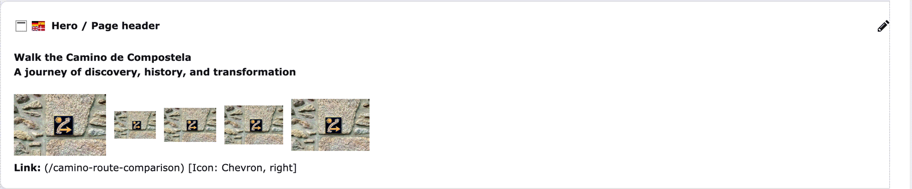 | 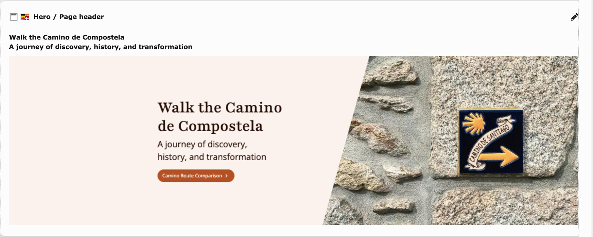 |
| 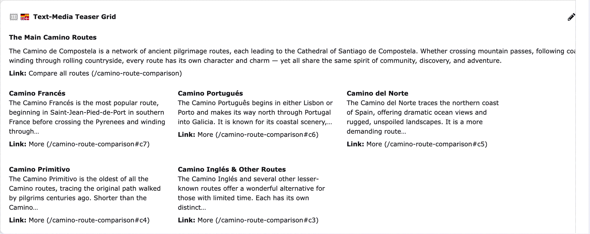 | 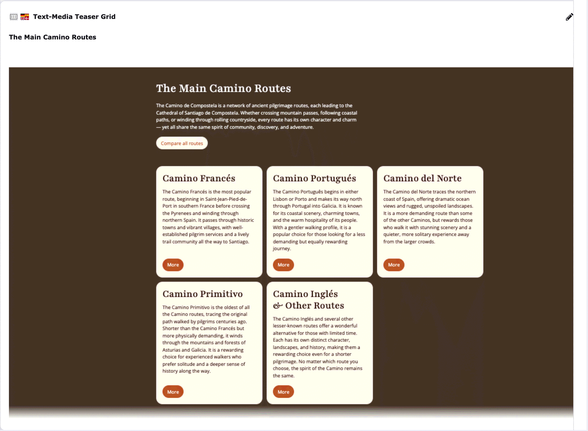 |
| 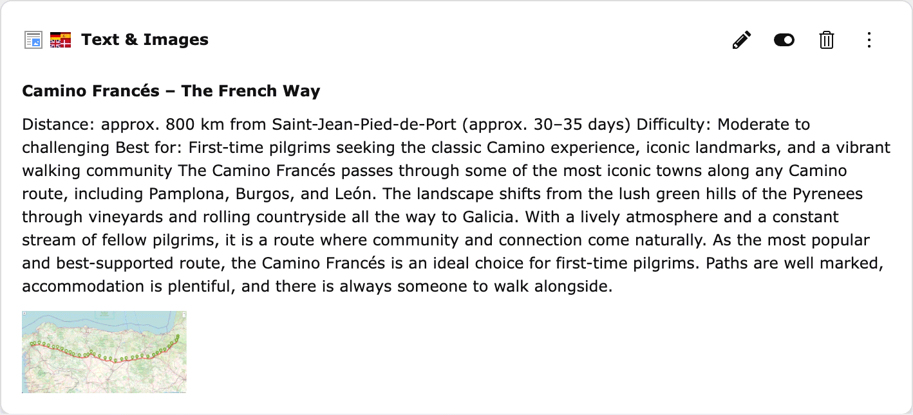 | 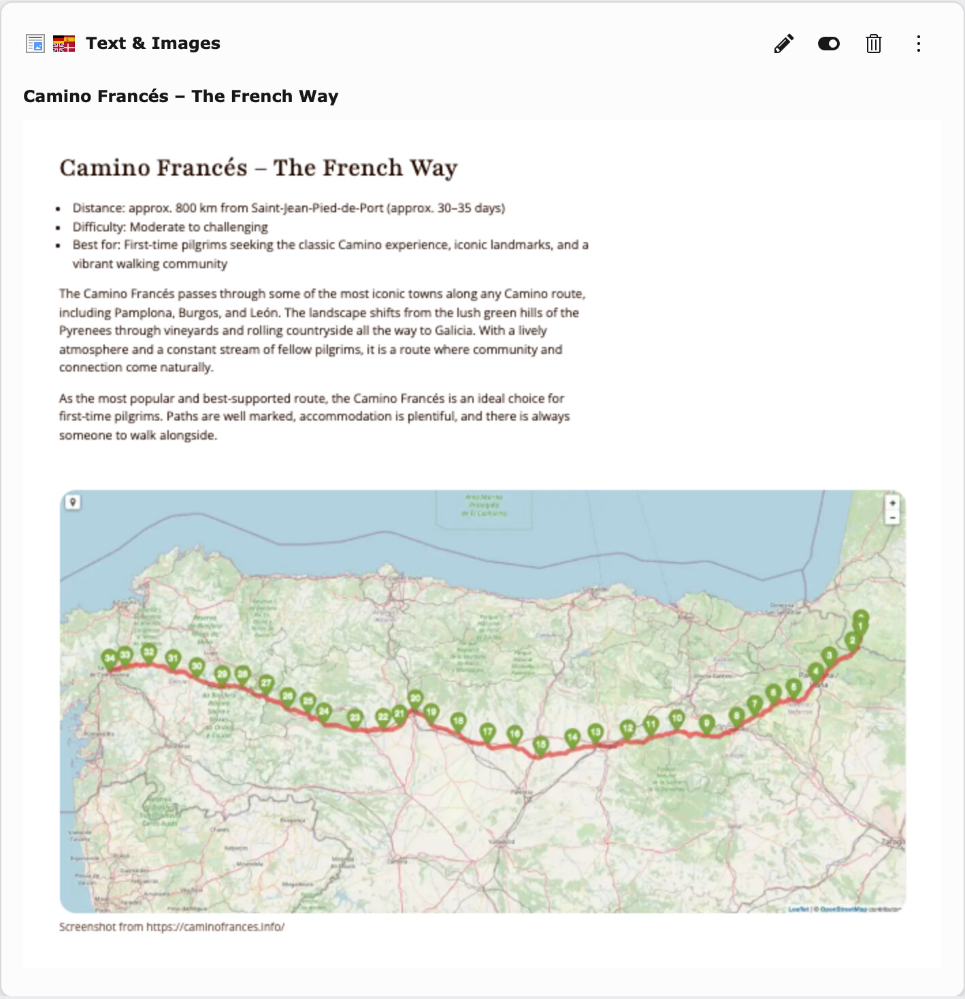 |

The whole page module, the page "Camino Route Comparison" from the Camino demo
content:

| Camino's preview | With Look |
|---|---|
| 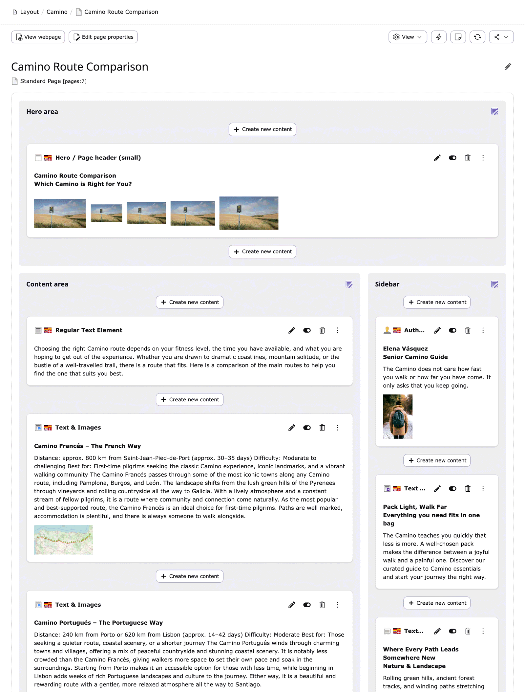 | 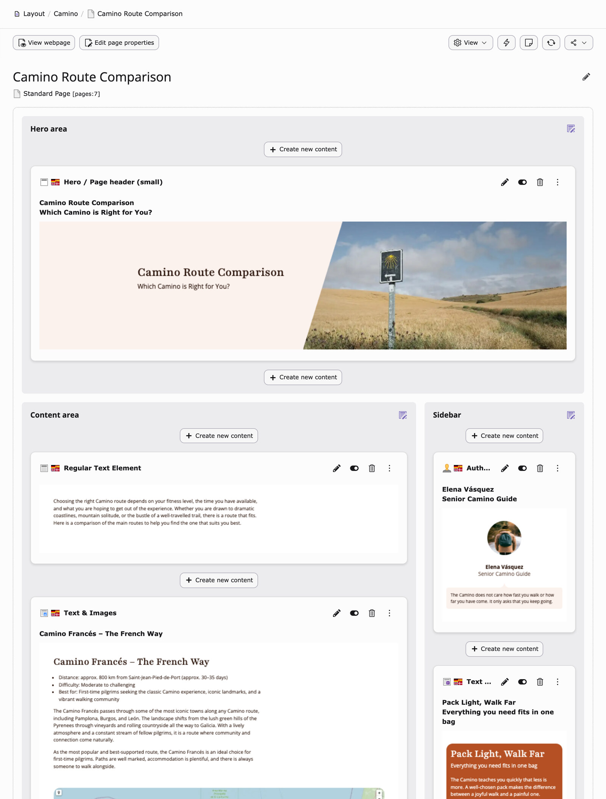 |

Documentation: https://docs.typo3.org/p/flowd/typo3-look-camino/main/en-us/

## Requirements

- TYPO3 14.3 or later, PHP 8.2 or later
- `typo3/theme-camino` and `flowd/typo3-look` 1.1 or later, both installed automatically

Camino itself requires TYPO3 14, so this extension does too.

## Installation

```bash
composer require flowd/typo3-look-camino
vendor/bin/typo3 extension:setup
```

Add the site set **Look previews for Camino** (`flowd/typo3-look-camino`) to your
site under *Sites > Setup*, next to *Theme: Camino*. The set brings the page
TSconfig that routes the Camino content types to the Look preview. No further
configuration is needed. Reload the page module.

## How it works

The extension is configuration only, which is what makes it a usable template
for your own site package. Its site set maps every Camino content type to one
preview template (`Resources/Private/Templates/Preview/Content.html`):

```html
<look:backend.contentPreview
    record="{record}"
    bodyClass="{look:site.setting(pageUid: record.pid, name: 'camino.colorScheme')}"
    css="{0: 'EXT:theme_camino/Resources/Public/Css/main.css'}"
    js="{0: 'EXT:theme_camino/Resources/Public/JavaScript/main.js'}" />
```

With `record`, Look renders the element with the frontend TypoScript of its
page in a separate request, so Camino's templates, partials and data
processors apply as on the website, including overrides from your site
package, and none of that PHP runs inside the page module. `look:site.setting`
puts the colour scheme from the site settings on the body of the preview
frame, so switching the scheme switches the previews:

| Caramel Cream | Forest Mist |
|---|---|
|  | 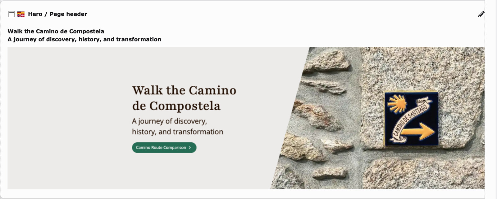 |

Sidebar teasers get a second template (`Teaser.html`) with a fixed height, as
an example of a per-type setting. The fade-out shows editors that the element
continues:

| Camino's preview | With Look |
|---|---|
| 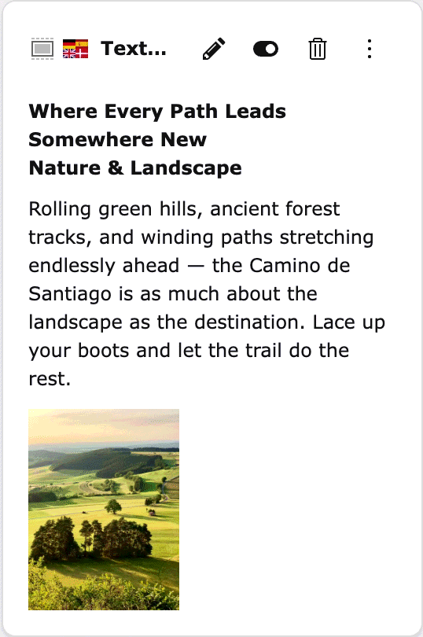 | 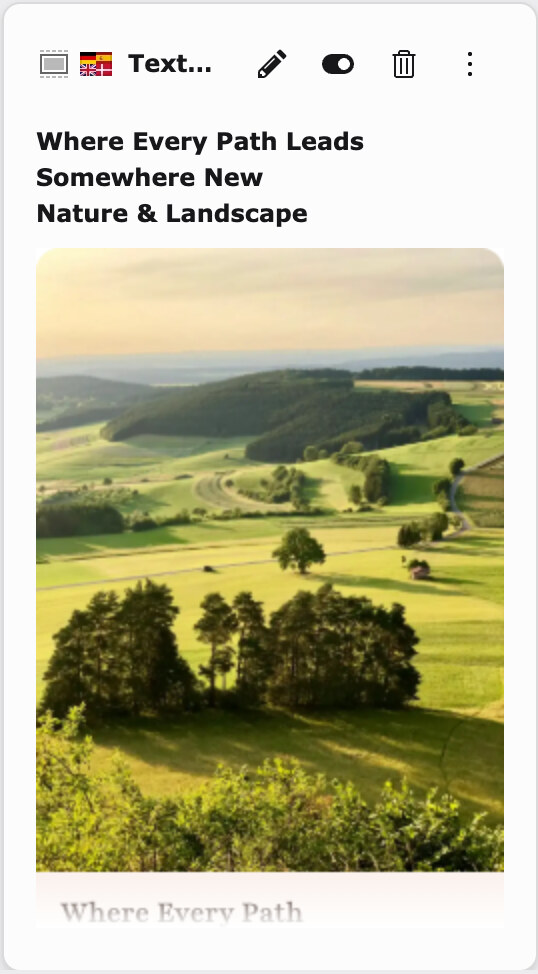 |

## Using the pattern in your own project

For a theme other than Camino, take the three pieces and adjust them:

1. A preview template that hands the record to Look and loads the stylesheet
   of your theme (`css`, optionally `js` and `bodyClass`).
2. Page TSconfig that maps your content types to that template via
   `mod.web_layout.tt_content.preview.<CType>`.
3. A site set (or your existing one) that ships the TSconfig.

The [Look documentation](https://docs.typo3.org/p/flowd/typo3-look/main/en-us/Usage/Index.html)
explains the view helper arguments and when to prefer Content Blocks with
Fluid Components instead.

## Options

Look's extension configuration and feature flags apply unchanged: scale and
maximum height of the previews, `editOverlay` for click-to-edit,
`allowSiteScripts` for Camino's JavaScript inside the frame, `allowMedia` for
videos. See the [Look documentation](https://docs.typo3.org/p/flowd/typo3-look/main/en-us/).

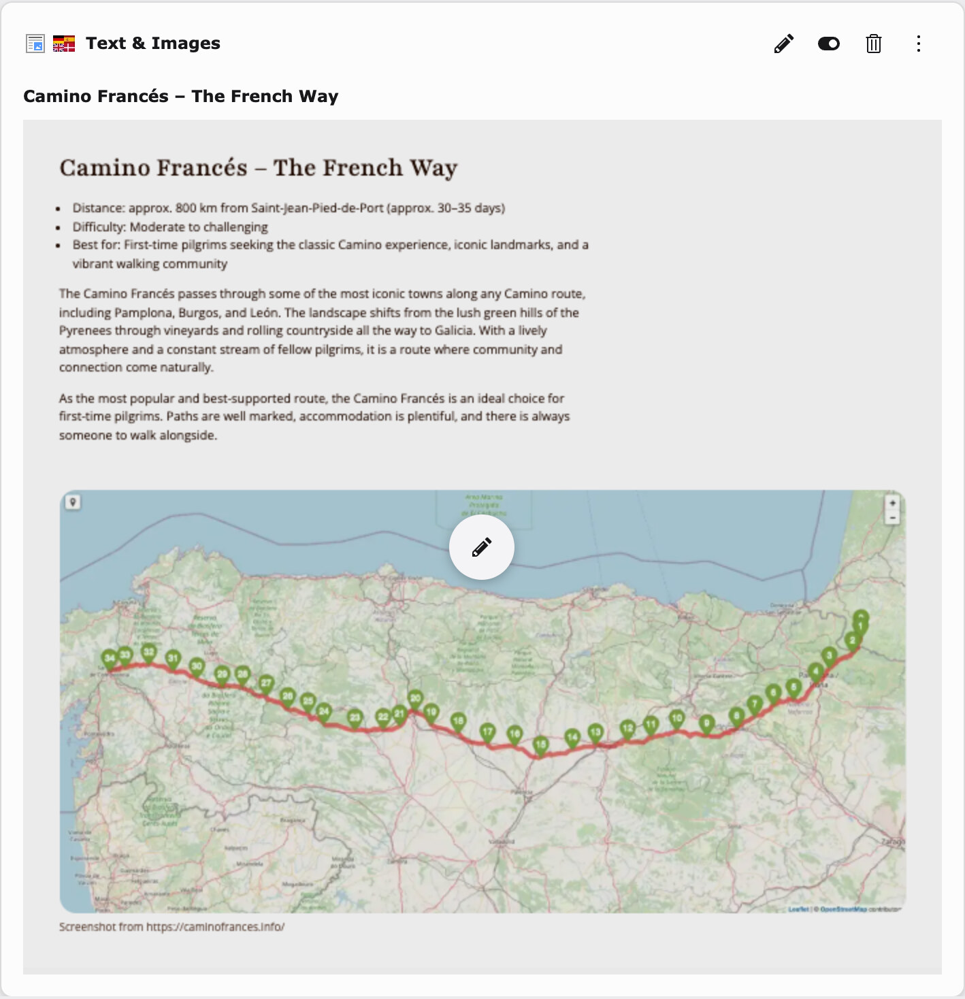

Camino's web fonts are loaded cross-origin inside the preview frame. The web
server has to send `Access-Control-Allow-Origin` for
`/_assets/*/Fonts/`, see *Installation* in the Look documentation.

## License

GPL-2.0-or-later. Made by [Flowd GmbH](https://www.flowd.de).
